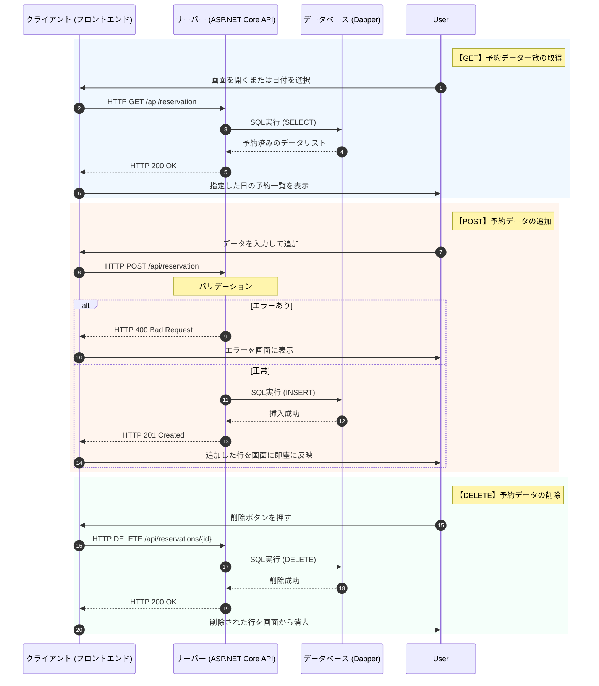

# 会議室使用予約システム

## 実装した機能 
1. **予約追加機能**  
   日時、場所、予約者を入力して追加する
2. **予約削除機能**  
   削除ボタンクリックすると予約していたのが削除される
3. **予約されている一覧の表示機能**  
   選択した日の予約一覧が表示される

## 役割分担
**設計: 細谷・渋谷**  
**テスト項目作成: 細谷・細谷**  
**クライアント側: 細谷**  
**サーバ側: 渋谷**  
**テスト実施: 細谷・渋谷**

## 処理の流れ

